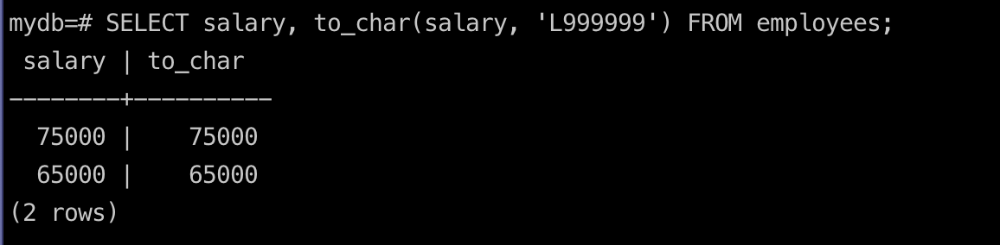
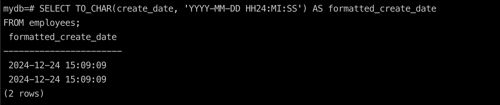

## how to convert char to number
`To convert char to number`
```sql
SELECT salary, to_char(salary, '999999') FROM employees;
```


## how to convert number to char
`To convert number to char`
```sql
SELECT salary, to_number(salary, '999999') FROM employees;
```

## how to convert char to date
`To convert char to date`
```sql
SELECT TO_CHAR(create_date, 'YYYY-MM-DD HH24:MI:SS') AS formatted_create_date
FROM employees;

```
