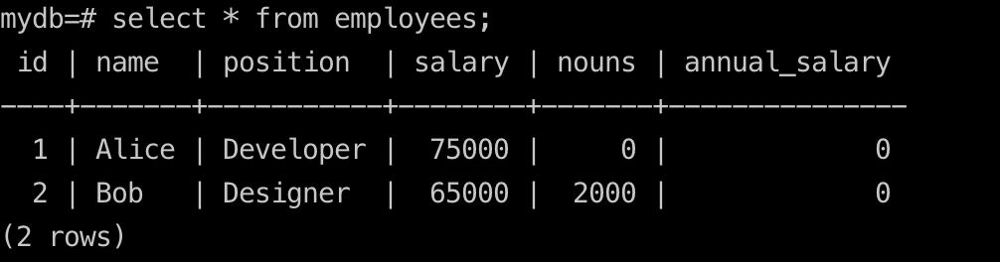
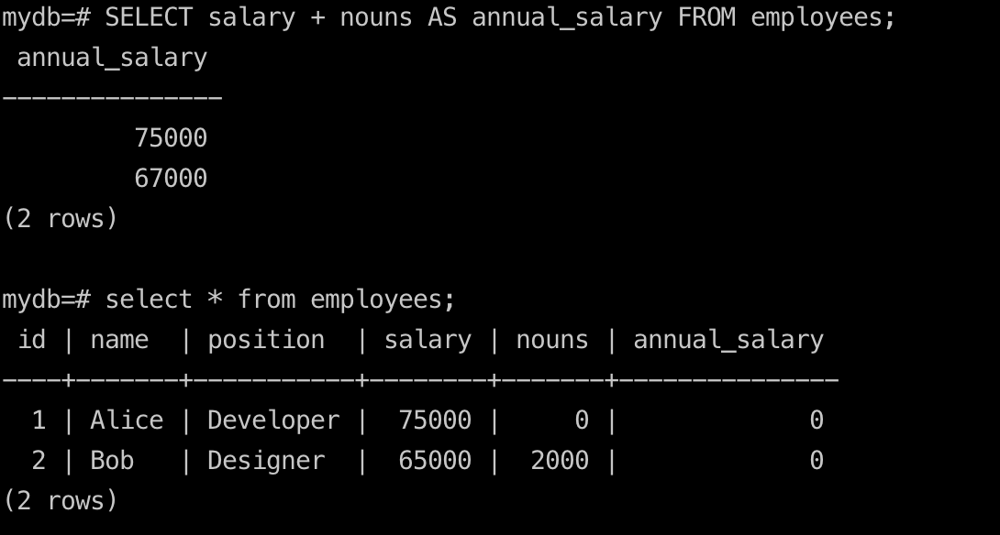

## Just insert base

## insert a value to a table

```
INSERT INTO employees (name, salary) VALUES ('Bob', 1000);
```

## Add

#### add a column of bonus to a table
```sql
ALTER TABLE employees ADD COLUMN bonus NUMERIC DEFAULT 0;
```


## Update

#### update a column of bonus to a table
```sql
UPDATE employees SET bonus = 2000 WHERE name = 'Bob';
```

## add and select 
`salary + nouns AS annual_salary`
```sql
SELECT salary + nouns AS annual_salary FROM employees;
```
