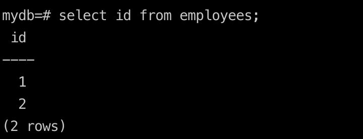
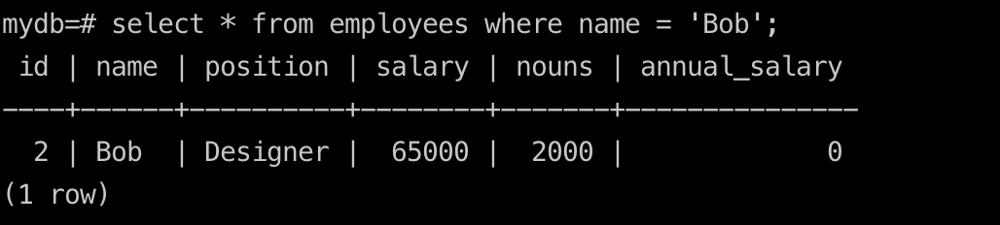
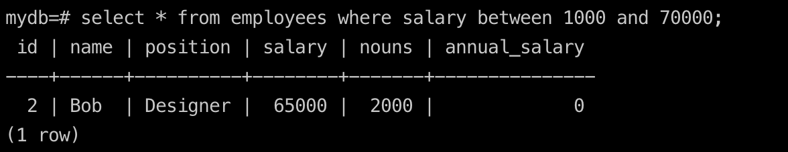
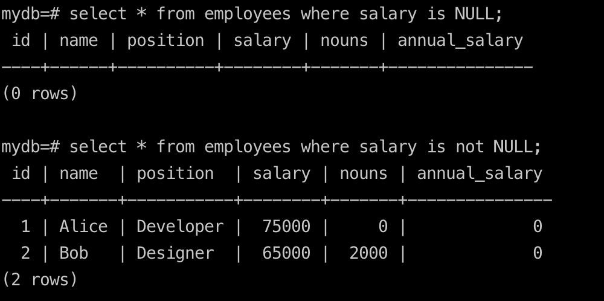
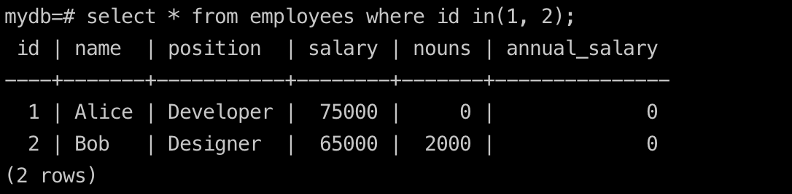
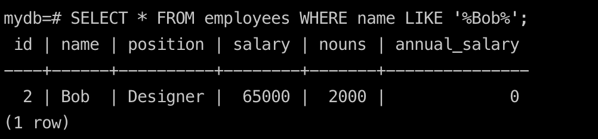
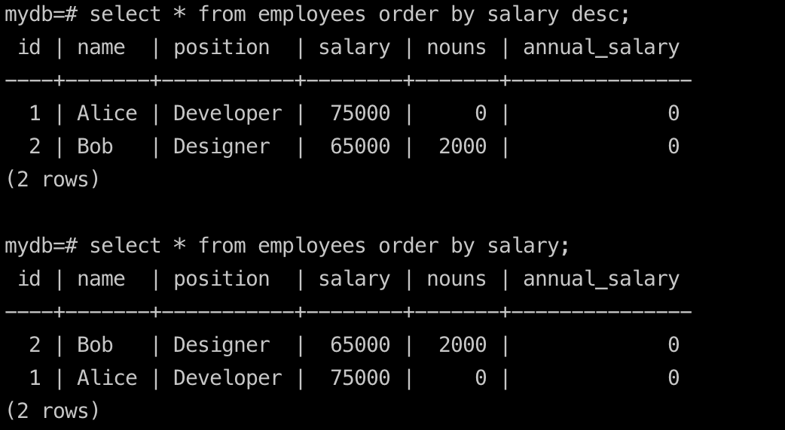
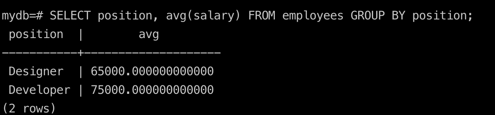

## Select base (select and where)

#### select all user in a table
`employees is a table name`
```sql
SELECT * FROM employees; 
```

#### just select id in a table

```sql
SELECT id FROM employees; 
```


#### select a user in a table (select and where)
`To use 'select' and 'where' to select a user in a table`
```sql
SELECT * FROM employees WHERE name = 'Bob';
```


`To use 'select', 'where' and 'between' to select a user in a table`
```sql
SELECT * FROM employees WHERE salary BETWEEN 1000 AND 0000;
```


#### select and where (or, and, not, NULL)

`To use 'select', 'where' and 'or' to select a user in a table`
```sql
SELECT * FROM employees WHERE salary BETWEEN 1000 AND 0000 OR salary BETWEEN 1000 AND 0000;
```

`To use 'select', 'where' and 'and' to select a user in a table`
```sql  
SELECT * FROM employees WHERE salary BETWEEN 1000 AND 0000 AND salary BETWEEN 1000 AND 0000;
```

`To use 'select', 'where' and 'not' to select a user in a table`
```sql
SELECT * FROM employees WHERE salary BETWEEN 1000 AND 0000 AND salary BETWEEN 1000 AND 0000;
```

#### how to select a value of NULL in a table
`To use 'select', 'where' to select a value of NULL in a table`
```sql
SELECT * FROM employees WHERE salary IS NULL;
```


#### how to use 'in' to select a value in a table
`To use 'select', 'where' and 'in' to select a value in a table`
```sql
SELECT * FROM employees WHERE id IN (1, 2);
```


#### how to use 'like' to select a value in a table
`To use 'select', 'where' and 'like' to select a value in a table`
```sql
SELECT * FROM employees WHERE name LIKE '%Bob%';
```
`note: like is fuzzy matching, % is a wildcard character`


#### how to use 'order by' to select a value in a table
`To use 'select', 'where' and 'order by' to select a value in a table`
```sql
SELECT * FROM employees ORDER BY salary; // from small to big
SELECT * FROM employees ORDER BY salary DESC; // from big to small
```


## select and date

#### how to select date
`To select date`
```sql
SELECT TO_CHAR(create_date, 'YYYY-MM-DD HH24:MI:SS') AS formatted_create_date
FROM employees;
```


#### how to use 'case' to select a value in a table
`To use 'select', 'where' and 'case' to select a value in a table`
```sql
SELECT 
    salary,
    CASE 
        WHEN position = 'Developer' THEN salary + 1000
        WHEN position = 'Designer' THEN salary + 800
        ELSE salary
    END AS adjusted_salary
FROM employees;
```

#### how to use 'count' to select a value in a table
`To use 'select', 'where' and 'count' to select a value in a table`
```sql
SELECT count(name) FROM employees;
```

#### how to use 'avg' to select a value in a table
`To use 'select', 'where' and 'avg' to select an average value in a table`
```sql
SELECT avg(salary) FROM employees;
```

## select and group by

#### how to use 'group by' to select a value in a table
`To use 'select', 'where' and 'group by' to select a value in a table`
```sql
SELECT position, avg(salary) FROM employees GROUP BY position having avg(salary) > 1000;
```
