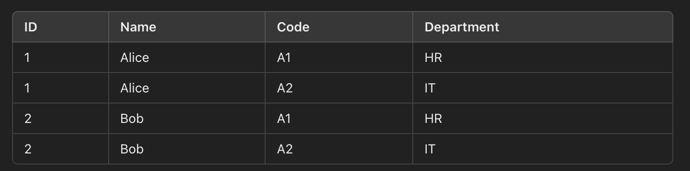

## select tables

When we want to select information from multiple tables, the result will create Cartesian product.

Cartesian product is a result of multiplying each row of the first table by each row of the second table.

#### example
table1:

table2:

```
SELECT * FROM A, B;
```
result:


#### how to use 'join' to select a value in a table
`To use 'select', 'where' and 'join' to select a value in a table`
```sql
SELECT employees.name, departments.department_name
FROM employees
JOIN departments ON employees.department_id = departments.id;
```

#### how to use 'inner join' to select a value in a table
`To use 'select', 'where' and 'inner join' to select a value in a table`
```sql
SELECT * FROM A INNER JOIN B ON A.id = B.id;
```

#### how to use 'left join' to select a value in a table
`To use 'select', 'where' and 'left join' to select a value in a table`
```sql
SELECT * FROM A LEFT JOIN B ON A.id = B.id;
```

#### how to use 'right join' to select a value in a table
`To use 'select', 'where' and 'right join' to select a value in a table`
```sql
SELECT * FROM A RIGHT JOIN B ON A.id = B.id;
```